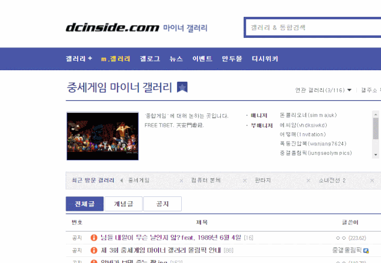

# 디씨 스위퍼

[디씨인사이드](https://www.dcinside.com/) 마이너갤러리에서 디시콘을 사용하기 쉽게 도와주는 크롬확장 툴입니다.

왼쪽 아래에 최근에 사용한 디씨콘을 띄워줍니다.

## 기타
* 확장 아이콘을 클릭해 기능을 활성화 또는 비활성화 할 수 있습니다.
* 본 소프트웨어를 이용함으로써 발생할 수 있는 어떠한 손해도 보장하지 않습니다.

# 사용법

이렇게 쓰면 됩니다.

## 설치
### 크롬 웹스토어 다운로드

## 버전 히스토리
 * **1.1 2019/06/04**
    * 활성화/비활성화 버튼의 UI를 개선합니다.
 * **1.0 2019/06/04**
    * 최초 공개
 
## 기술명세
* HTML5/CSS3/javascript(ES2018)

## 라이센스
본 프로젝트는 [GNU General Public License 허가서](./LICENSE) 하에 제공됩니다. 

